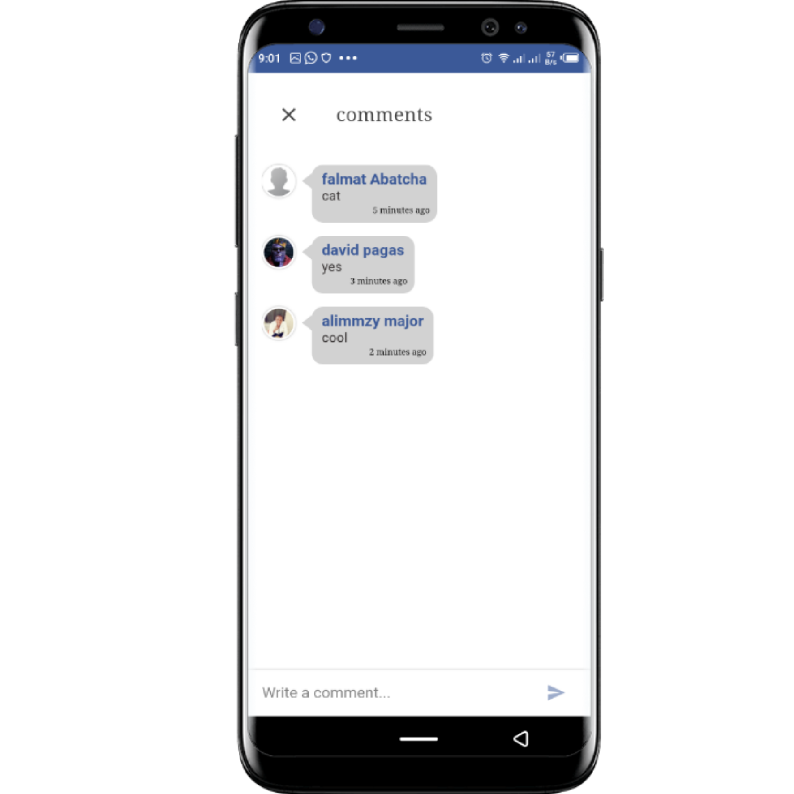

### social-chat-ionic4
 

        Document: <a
            href="https://drive.google.com/open?id=1MHqUnbSS_5YDX_v7BB1l8oSUVz1LqRh3">https://drive.google.com/open?id=1MHqUnbSS_5YDX_v7BB1l8oSUVz1LqRh3</a>
    

     

        Android apk: 
    

    
<strong>Overview</strong> 

    

    

       This Application covers everything that you need in social chat application, in ionic 4 and firebase leatest
        version. This is clean code, more readable and beautiful, the same functionality of facebook, whatsapp,
        messenger This Application tested and trusted on Android, OS, also this code is written on ionic 4 framework and
        firebase leatest version, the app uses SASS, which is known as CSS with power of each component has dedicated
        SASS file for styling make it very beautiful looking UI.
    

YoutubeURL : https://www.youtube.com/watch?v=OznzcyiKqbY 

 

    <h2>
        1st Version
    </h2>
    <ul>
        <li>Social Chat Application with ionic 4 fully Hybrid App using Angular 8.</li>
        <li>Implement Push notification.</li>
        <li>App will release in PWA.</li>
        <li>Multiple language support.</li>
        <li>User Login and Register.</li>
        <li>User Login with Facebook Account.</li>
        <li>User login with Google Account.</li>
        <li>User can chat with each other and also see recents chat and previous chats.</li>
        <li>User can post through his timeline.</li>
        <li>User like and comment on post.</li>
        <li>User can view his comment Notification and Replay, base on what his post in the timeline.</li>
        <li>Location Sharing.</li>
        <li>User search friends.</li>
        <li>Accept Friend request/ Send friend request.</li>
        <li>Unfriend User</li>
        <li>User see, Who is online and Last seen.</li>
        <li>User create groups chat.</li>
        <li>Groups Admin, also add friend to group/Admin can delete.</li>
        <li>User can delete message.</li>
        <li>Post reporting.</li>
        <li>Social Sharing.</li>
        <li>E.T.C</li>
    </ul>
    

    

        Note: Please if you have any suggestion or extra feature you want to change, Please mail me
        <a href="mailto:abubakarpagas@gmail.com">abubakarpagas@gmail.com</a>
    

### Requirments
<h5>•	Xcode</h5>
<h5>•	visual studio code.</h5>
<h5>•	Android studio.</h5>
<h5>•	Node js.</h5>
<h5>•	Ionic 4 framework.</h5>
<h5>•	Firebase.</h5>
<h5>•	Cordova.</h5>

 

 

 

 

